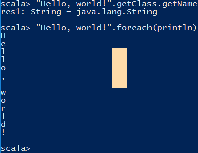
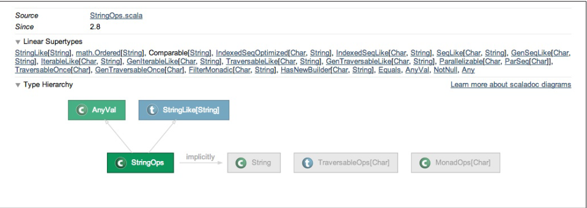

# Strings 方法

- String 的比较
- String 多行显示
- String 切分
- String 每次只处理一个字符
- String 查找符合正则的字符串
- String 截取符合正则的字符串部分
- String 获取其中的字符
- String 添加自己创建的 字符串方法到 String class 上

## Introduction

安装 Scala 之后, 直接在命令行运行 `scala` 即可进入 Scala REPL (Read-Evaluate-Print-Loop) 环境



```shell
scala 
```

1. Scala 的 String 类型与 Java 
```scala
scala> "Hello, world!".getClass.getName
res1: String = java.lang.String

scala> "Hello, world!".foreach(println)
H
e
l
l
o
,

w
o
r
l
d
!

# 添加字符变量
val s = "Hello, world"

# 获取 字符长度
s.length 

# 也可以两个字符拼接成一个变量
val s = "Hello" + " world"
```

因为 Scala 提供一些隐式转换函数, String 的实例也可以使用 `StringOps` 类的方法, 因此 String 实例可以使用更多的方法:



1. foreach 方法

```scala 
# 遍历 String 的字符
scala> "hello".foreach(println)
h
e
l
l
o

scala> for (c <- "hello") println(c)
h
e
l
l
o

# 遍历 String 的字符 Byte
scala> val s = "Hello" + " world"
s: String = Hello world

scala> s.getBytes.foreach(println)
72
101
108
108
111
32
119
111
114
108
100
```

2. filter 方法

```scala 
scala> val result = "hello world".filter(_ != 'l')
result: String = heo word
```

### 添加方法到闭包类

虽然 String 类已经被 Java 声明为 `final` 类型, 但是 Scala 仍可以通过 隐式转换 (implicit conversions) 来将自己的方法添加到 String 类上

## String Equality


## Mutiline Strings 

## Spliting Strings

## Processing a String One Character at a Time 


## Finding Pattern in Strings 

## Replacing Patterns in Strings 

## Extracting Parts of a String That Match Patterns 

## Accessing a Character in a String 

## add Your Own Method to the String Class